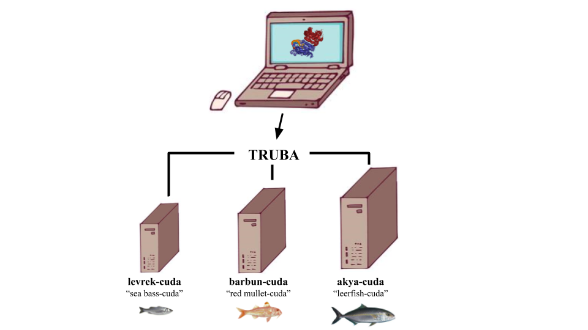

# GROMACS performance optimization on the Turkish National Grid Resources TRUBA



#### by Büşra Savaş and Ezgi Karaca

## Motivation

Molecular dynamics (MD) simulations become computationally demanding since could be used for the systems with hundreds to millions atoms to investigate molecular motions. 
Therefore, high performance computing (HPC) system is a must to examine large systems with MD. Here, we explore the performance of TRUBA, Turkey's HPC system offered by TUBITAK ULAKBIM with a well-known MD package GROMACS. 

## Feautures of the Simulations 

- For each run, we used a protein-DNA-ligand complex, composed of 8693 number of atoms.
- Together with the solvent and ions, the total number of atoms rises to 150891.
- The starting structure is coming from the "Exploring the Epigenetic Methylation Mechanisms within the context of Structural Biology" project supported by BIDEB-2232 (1109B321700106) and HPC-EUROPA3 (INFRAIA-2016-1-730897).
- Amber14sb-PARMBSC1 force-field is used for each run.
- Two different GROMACS versions (GROMACS 5.1.4 and GROMACS 2020) are probed.
- Among nine computing clusters on TRUBA, we have chosen the ones with GPU cards (levrekv2-cuda, barbun-cuda and akya-cuda).
- The CPU/GPU ratio of the clusters on a single node are; 24/2 for levrekv2-cuda, 40/2 for barbun-cuda and 40/4 for akya-cuda.
- During simulations, we have also probed the impact of using different energy groups, as Protein_DNA_SAM and System.

Here are the several different run combinations we have tried:

 Version  | GROMACS version | Computing Cluster | CPU/GPU ratio | Energy Group 
 -------- | --------------- | ----------------- | ------------- | ------------
 1 | 5.1.4 | Levrekv2-cuda | 24/1 | Protein_DNA_SAM
 2 | 5.1.4 | Levrekv2-cuda | 24/1 | System
 3 | 5.1.4 | Akya-cuda | 40/1 | Protein_DNA_SAM
 4 | 5.1.4 | Akya-cuda | 40/1 | System
 5 | 2020 | Akya-cuda | 40/- | Protein_DNA_SAM
 6 | 2020 | Akya-cuda | 40/1 | System
 7 | 2020 | Akya-cuda | 40/2 | System
 8 | 2020 | Akya-cuda | 40/3 | System
 9 | 2020 | Akya-cuda | 40/4 | System
10 | 2020 | Barbun-cuda | 40/- | Protein_DNA_SAM
11 | 2020 | Barbun-cuda | 40/1 | System
12 | 2020 | Barbun-cuda | 40/2 | System

## Our folders describe:

- **application_example:** contains all the relevant input files provided under subdirectories to re-run our simulation combinations: 
  - **force_field:** contains the force field files.
  - **starting_structures:** contains the starting structures our system (DNMT3A-DNA-SAM, pdb id: 6f57). Since the ligand parameters were not available in the force field, we have generated them with acepype (carried out by Deniz Doğan ([@denizdgn](https://github.com/denizdgn))).
  - **mdp_files:** contains subdirectories of required .mdp simulation files, with defined (Protein_DNA_SAM) and generic (System) energy groups.
  - **scripts:** contains the relevant TRUBA slurm files.
- **slurm_files:** contains the slurm files of each the simulations listed in the above-given table.
- **log_files:** contains the log files of each simulation.
- **graph:** contains the GPU Performance graph and jupyter notebook script to obtain the graph.
  
## Running the simulations 
**1) Connecting TRUBA**

After applying for an account, you can connect to TRUBA by following the instructions on wiki page of TRUBA (http://wiki.truba.gov.tr/).

**2) Setting the right environment variable to run things interactively)** \
:exclamation: Please be aware that, this should be only for testing purposes, never run something heavy on the login node.

As Gromacs 2020 is installed on Barbun, to test things with Gromacs 2020, first ssh to barbun cluster.

:exclamation: While you are already logged into levrek1 (ssh username@172.16.7.1)

```
ssh 172.16.11.1
```

Then:
```
source /truba/sw/centos7.3/comp/intel/PS2018-update2/bin/compilervars.sh intel64
module load centos7.3/comp/cmake/3.10.1
module load centos7.3/comp/gcc/6.4
```
This will set the right environment to call Gromacs 2020 on TRUBA.

To call GROMACS as **$gmx**:

If you use bash:
```
export gmx=/truba/sw/centos7.3/app/gromacs/2020-impi-mkl-PS2018-GOLD/bin/gmx
```
or if you use csh:

```
set gmx=/truba/sw/centos7.3/app/gromacs/2020-impi-mkl-PS2018-GOLD/bin/gmx
```

You can include these lines also in your .bashrc or .cshrc profiles.

**3) Setting a simulation with GROMACS 2020**

To generate gro and itp files (topology and parameter files) for "complex.pdb" file.
```
sbatch 01_generate-inital-gro.slurm
```
Since ligand is not recognized by the force field, we need to edit complex.gro manually:

- i) To cap the charge at the beginning and the end of each DNA chain
	These changes below should be done in complex.gro;
	
	chain Y: 365DC (5') & 374DT (3') -- they should be changed to 365DC5 & 374DT3
	
	chain X: 355DA (5') & 364DG3 (3') -- they should be changed to 355DA5 & 364DG3
	
	These definitions are found in amber14sb_parmbsc1.ff/dna.rt
 
- ii) To include SAM (small molecule) parameters that are calculated externally
	
	Paste the coordinates of ligand from SAM.gro file at the end of complex.gro file (before the final line)
	
	:exclamation:Update the number of atoms that are in the header of the gro file accordingly (8643 to 8693)
	
	:exclamation:Update the atom numbers of SAM so that the numbers are consecutive
	
- iii) Include the relevant topology parameters according to SAM addition
	Add the following lines to complex.top file;
 	; Include ligand top
 	#include "SAM.itp"
	Also, at the end of the file, include this line;
 	SAM                 1

After the updates, to start vacuum minimization:
```
sbatch 02_solvate_vacuum_minim.slurm
```
Check how many ions are added into the system by (this changes each time):
```
grep "K" complex-solvated.gro | wc -l
grep "CL" complex-solvated.gro | wc -l
grep "OW" complex-solvated.gro | grep SOL | wc -l
```
These numbers should be updated in the topology file (complex.top)

:exclamation: Should be added at the end of the file.

To complete MD preperation:
```
sbatch 03_after_top_edit.slurm
```
To run MD:
```
sbatch 04_production.slurm
```
After the log files are created. We can see the performance of the simulations:
```
tail -50 complex_md.log 
```
The performance of all simulations are given in the table below.

Version | Performance (ns/day)
------- | -------------------
1 | 6.374 
2 | 6.939 
3 | 37.557
4 | 38.663
5 | 14.924
6 | 71.372
7 | 69.463
8 | 69.360
9 | 71.072
10 | 14.285
11 | 40.038
12 | 40.012

To draw the graph, you can use the jupyter notebook script under the graph directory. 

## Acknowledgements
This research is supported by TUBITAK under the 1002 support program with the project number 119Z828. We would like to thank Deniz Doğan ([@denizdgn](https://github.com/denizdgn)), who initiated this study.  We are also grateful to TUBITAK ULAKBIM for providing us the access to the TRUBA resources. 

## Contact 
ezgi.karaca@ibg.edu.tr
